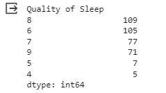

# Laporan Proyek Machine Learning
### Nama : Mawar Wiliyanti
### Nim : 211351080
### Kelas : IF Pagi A

## Domain Proyek
Proyek ini dapat melakukan analisis terhadap pola tidur dan kualitas tidur. agar kita dapat waktu tidur yang cukup dengan mengidentifikasi faktor-faktor yang mempengaruhi kualitas tidur, seperti durasi tidur, waktu tidur, atau aktivitas sebelum tidur.

## Business Understanding
Dapat membantu pengguna memantau dan meningkatkan kualitas tidur agar meningkatkan produktivitas dalam kegiatan sehari-hari.

Bagian laporan ini mencakup:

### Problem Statements
Bagaimana produktivitas seseorang dapat mengganggu kualitas tidur dan pola tidur seseorang sehingga sulit untuk menentukan jam tidur yang cukup.

### Goals
Menetapkan standar jam tidur yang cukup berdasarkan produktivitas kerja yang optimal dan kesehatan fisik serta mental.

### Solution statements
- Membangun platform digital yang berbasis web untuk memantau pola tidur individu, menganalisis data produktivitas kerja, dan menggabungkannya dengan informasi kesehatan fisik dan mental untuk menetapkan standar jam tidur yang cukup.
- Mengembangkan model machine learning dengan menggunakan metode Regresi Linier.

## Data Understanding
Menggunakan dataset yang berasal dari kaggle yang berisi Tingkat kualitas tidur seseorang. terdiri dari 400 baris dan 13 kolom, yang mencakup berbagai variabel yang berkaitan dengan tidur dan kebiasaan sehari-hari.

[Sleep Health and Lifestyle Dataset](https://www.kaggle.com/datasets/uom190346a/sleep-health-and-lifestyle-dataset/data).

### Variabel-variabel pada Sleep Health and Lifestyle Dataset adalah sebagai berikut:
- Person ID: Pengenal untuk setiap individu.
- Gender: Jenis kelamin orang tersebut (Male/Female).
- Age: Usia orang tersebut dalam tahun.
- Occupation: Pekerjaan atau profesi orang tersebut.
- Sleep Duration (hours): Jumlah jam orang tersebut tidur per hari.
- Quality of Sleep (skala: 1-10): Penilaian subjektif dari kualitas tidur, mulai dari 1 hingga 10.
- Physical Activity Level (menit/hari): Jumlah menit orang tersebut melakukan aktivitas fisik setiap hari.
- Stress Level (skala: 1-10): Penilaian subjektif dari tingkat stres yang dialami oleh orang tersebut, mulai dari 1 hingga 10.
- BMI Category: Kategori BMI orang tersebut (misalnya, Underweight, Normal, Overweight).
- Blood Pressure (systolic/diastolic): Pengukuran tekanan darah seseorang, yang ditunjukkan sebagai tekanan sistolik atau tekanan diastolik.
- Heart Rate (bpm): Denyut jantung istirahat seseorang dalam denyut per menit.
- Daily Steps: Jumlah langkah yang dilakukan seseorang per hari.
- Sleep Disorder: Ada atau tidaknya gangguan tidur pada orang tersebut (Tidak Ada, Insomnia, Sleep Apnea).

## Data Preparation
### Data Collection 
untuk data yang digunakan saya menggunakan dataset dengan nama Sleep Health and Lifestyle Dataset yang didapat dari website kaggle.

### Data Discovery and Profiling
Karena kita menggunakan google colab maka kita harus mengimport file dan mengupload token yang di download dari kaggle terlebih dahulu agar kita bisa mendownload file dataset dari kaggle melalui google.colab

```bash
from google.colab import files
files.upload()
```
Setelah mengupload token, selanjutnya kita akan membuat folder untuk menyimpan file kaggle.json yang sudah diupload

```bash
!mkdir -p ~/.kaggle
!cp kaggle.json ~/.kaggle/
!chmod 600 ~/.kaggle/kaggle.json
!ls ~/.kaggle
```
Setelah berhasil, langkah selanjutnya kita download datasetnya

```bash
!kaggle datasets download -d uom190346a/sleep-health-and-lifestyle-dataset
```

kita extract file yang telah di download tadi

```bash
!mkdir sleep-health-and-lifestyle-dataset
!unzip sleep-health-and-lifestyle-dataset.zip -d sleep-health-and-lifestyle-dataset
!ls sleep-health-and-lifestyle-dataset
```
setelah proses extract selesai, mari kita import library yang dibutuhkan

```bash
import pandas as pd
import numpy as np
import matplotlib.pyplot as plt
import seaborn as sns
from sklearn.model_selection import train_test_split
from sklearn.linear_model import LinearRegression
```

selanjutnya kita masukkan file csv yang telah diextract pada sebuah variabel

```bash
df= pd.read_csv('sleep-health-and-lifestyle-dataset/Sleep_health_and_lifestyle_dataset.csv')
```

lalu kita lihat 5 baris teratas pada dataset kita

```bash
df.head()
```
Selanjutnya mari kita lihat type data pada masing-masing kolom yang ada di dataset kita

```bash
df.info()
```
<br>
Berdasarkan data diatas, kita dapat menyimpulkan bahwa Age, Sleep duration, Physical activity level, Blood pressure, Heart rate, dan Daily step adalah data kontinu (dapat mengambil nilai apa pun yang memungkinkan untuk kolom yang diberikan) sementara Gender, Occupation, Quality of sleep, Stress level, Kategori BMI, dan Sleep disorder adalah data kategorik (misalnya Jenis Kelamin dapat berupa Pria atau Wanita dalam set data yang diberikan).<br>
<br>
Selanjutnya kita akan memeriksa apakah terdapat baris yang kosong atau null pada dataset kita dengan menggunakan seaborn

```bash
sns.heatmap(df.isnull())
```
<br>
jika data sudah aman maka kita lanjut dengan data exploration kita

```bash
plt.figure(figsize=(10,8))
sns.heatmap(df.corr(), annot=True)
```
<br>

selanjutnya, kita akan melihat jumlah nilai dari beberapa kolom kategorikal satu per satu.<br>

```bash
df.iloc[:,[1]].value_counts()
```
<br>
data diatas menunjukkan bahwa dari 374 catatan orang yang berbeda, 189 adalah Pria dan 185 adalah Wanita.<br>

selanjutnya kita akan melihat jumlah orang sesuai dengan profesinya masing-masing
```bash
df.iloc[:,[3]].value_counts()
```
<br>
data diatas menunjukkan jumlah masing-masing orang dari berbagai profesi. Sebagai contoh, dari 374 catatan orang dalam dataset, 73 orang adalah perawat, diikuti oleh 71 dokter, dan seterusnya.

```bash
df.iloc[:,[5]].value_counts()
```
<br>

Data diatas menunjukkan Sebanyak 109/374 orang menilai kualitas tidur mereka adalah 8, diikuti oleh 105 orang yang menilai kualitas tidur mereka adalah 6 dan seterusnya.

```bash
df.iloc[:,[8]].value_counts()
```
<br>
BMI category, yang merupakan indikator yang baik untuk kesehatan seseorang. Orang dengan BMI normal, umumnya diasumsikan lebih sehat dibandingkan dengan mereka yang memiliki BMI lebih tinggi. Melihat data BMI diatas, kita melihat bahwa ada dua label yang berbeda untuk orang dengan kategori BMI normal, disini kita akan mengubahnya menjadi Normal.<br>

```bash
df.loc[df['BMI Category']=='Normal Weight',['BMI Category']] = 'Normal'
df.iloc[:,[8]].value_counts()
```
<br>
Setelah diubah,  dapat dilihat bahwa sebanyak 216 dari 374 orang memiliki BMI Normal, diikuti oleh 148 orang yang kelebihan berat badan dan 10 orang sisanya mengalami Obesitas.

```bash
(df.iloc[:,[12]].value_counts()/df.iloc[:,[12]].value_counts().sum())*100
```
<br>
dari data diatas, kita melihat bahwa sekitar 41% orang menderita Sleep Apnea dan Insomnia.
<br>

untuk tahap selanjutnya Mari kita lihat variasi Durasi Tidur dan Kualitas Tidur berdasarkan profesi.
```bash
df1 = df.groupby('Occupation')[['Quality of Sleep','Sleep Duration']].mean().sort_values(by=['Quality of Sleep'])
```
```bash
ax = plt.subplot(1,1,1)
x = pd.Series(df1.index,dtype='category')
ax.scatter(x,y=df1['Sleep Duration'].to_numpy(),marker='^')
ax.scatter(x,y=df1['Quality of Sleep'].to_numpy())
plt.xticks(rotation=90)
plt.legend(['Durasi tidur','Kualitas tidur'])
plt.ylim(0,12)
plt.title('Kualitas tidur berdasarkan profesi')
plt.show()
```
<br>
Dari plot di atas, kita dapat menyimpulkan beberapa poin di bawah ini:

- Sales Representative memiliki kualitas tidur yang paling buruk, sementara  Engineers memiliki kualitas tidur yang paling baik.
- Software Engineers berada di peringkat ke-4 dari terakhir, dalam hal Kualitas Tidur dan Durasi Tidur.
- Melihat plot sebarannya, kita bisa mengatakan bahwa kualitas tidur meningkat seiring dengan durasi tidur.

<br>
Selanjutnya, Mari kita lihat Kualitas tidur berdasarkan tingkat aktivitas fisik dan tingkat stress

```brash
df2 = df.groupby('Quality of Sleep')[['Physical Activity Level','Stress Level']].mean()
```
```brash
ax = plt.subplot(1,1,1)
x = df2.index
ax.scatter(x,df2['Physical Activity Level'].to_numpy()/10,marker='o')
ax.scatter(x,df2['Stress Level'].to_numpy(),marker='^')
ax.set_xlabel('Kualitas tidur-->')
plt.ylim(0,10)
plt.title('Kualitas tidur berdasarkan tingkat aktivitas fisik dan tingkat stress')
plt.legend(['Tingkat aktivitas fisik','Tingkat stress'])
plt.show()
```
<br>
Dari diagram di atas, kita memiliki kualitas tidur di sepanjang sumbu x. Aktivitas Fisik & Tingkat Stres berada di sepanjang sumbu y. Kita dapat melihat bahwa, ketika tingkat aktivitas fisik meningkat, tingkat stres berkurang dan kualitas tidur juga meningkat. Oleh karena itu, kita dapat menyimpulkan bahwa tingkat aktivitas fisik dan tingkat stres berkorelasi terbalik. Yang pertama memiliki korelasi positif dengan kualitas tidur, sementara yang kedua memiliki korelasi negatif.

- Aktivitas Fisik vs Kualitas Tidur telah menunjukkan bahwa keduanya memiliki korelasi positif, seiring dengan meningkatnya aktivitas fisik seseorang, kualitas tidurnya juga akan meningkat.
- Tingkat Stres vs Kualitas Tidur telah menunjukkan bahwa keduanya memiliki korelasi negatif, kualitas tidur menurun seiring dengan meningkatnya stres.


Untuk selanjutnya kita akan membuat distribusi dari Quality of Sleep
```brash
plt.figure(figsize=(15,5))
sns.distplot(df['Quality of Sleep'])
```
<br>
Dari diagram diatas kita telah mendapatkan nilai distribusi dari Quality of sleep.

untuk tahap selanjutnya yaitu tahap modeling.

## Modeling
Langkah pertama adalah seleksi fitur, kita akan memilih kolom apa yang dijadikan fitur dan kolom apa yang dijadikan target.

```bash
features = ['Person ID', 'Age',	'Sleep Duration',	'Physical Activity Level',	'Stress Level',	'Heart Rate',	'Daily Steps']
x = df[features]
y = df['Quality of Sleep']
x.shape, y.shape
```
untuk hasilnya kita mendapatkan 374 baris 7 kolom untuk fitur dan 374 baris 1 kolom untuk target

Tahap berikutnya kita akan melakukan split data, kita masukkan library dan kodenya
```bash
from sklearn.model_selection import train_test_split
x_train, x_test, y_train, y_test = train_test_split(x,y,random_state=70)
y_test.shape
```
setelah kita split dari 394 data kita ambil 94 data untuk data testingnya.

Selanjutnya kita akan membuat model untuk regresi liniernya
```bash
from sklearn.linear_model import LinearRegression
lr = LinearRegression()
lr.fit(x_train,y_train)
pred = lr.predict(x_test)
```

jika sudah kita melihat akurasi dari model kita
```bash
score = lr.score(x_test, y_test)
print('akurasi model regresi linier = ', score)
```
untuk akurasi model regresi linier yang kita dapatkan yaitu 0.8707745033453198 atau 87%.

Selanjutnya kita akan Membuat inputan model regresi linier
```bash
#Person ID= 8, Age=32, Sleep Duration=6.1, Physical Activity Level=42, stress level=8, heart rate=85, daily steps=4200
input_data = np.array([[8,32,6.1,42,8,85,4200]])

prediction = lr.predict(input_data)
print('Tingkat kualitas tidur :', prediction)
```
jika sudah berhasil maka kita akan menyimpan model yang telah kita buat

```bash
import pickle

filename ='kualitas_tidur.sav'
pickle.dump(lr,open(filename,'wb'))
```

## Evaluation

Pada bagian ini saya menggunakan akurasi sebagai Metric evaluasi.
- Akurasi digunakan untuk mengukur seberapa baik model memprediksi nilai aktual atau kelas target dalam suatu dataset. Akurasi dapat dihitung dengan rumus :
<br>
- Setelah itu saya menerapkannya dalam kode menggunakan fungsi akurasi, sebagai berikut :
```bash
from sklearn.metrics import r2_score

features = ['Person ID', 'Age', 'Sleep Duration', 'Physical Activity Level', 'Stress Level', 'Heart Rate', 'Daily Steps']
x = df[features]
y = df['Quality of Sleep']

model = LinearRegression()
model.fit(x, y)

# Melakukan prediksi menggunakan model
y_pred = model.predict(x)
r_squared = r2_score(y, y_pred)

# Menampilkan R-squared
print("R-squared (R^2):", r_squared)
```
Nilai R-squared sekitar 0.9115004951252951 menunjukkan bahwa sekitar 91.15% variasi dalam variabel target ("Quality of Sleep") dapat dijelaskan oleh fitur-fitur yang telah dimodelkan. Nilai R-squared yang tinggi (mendekati 1) menunjukkan bahwa model Anda sangat baik dalam menjelaskan variasi dalam data. Model ini cocok dengan data dengan sangat baik dan memiliki kemampuan prediksi yang tinggi untuk variabel target "Quality of Sleep" berdasarkan fitur-fitur yang digunakan.

